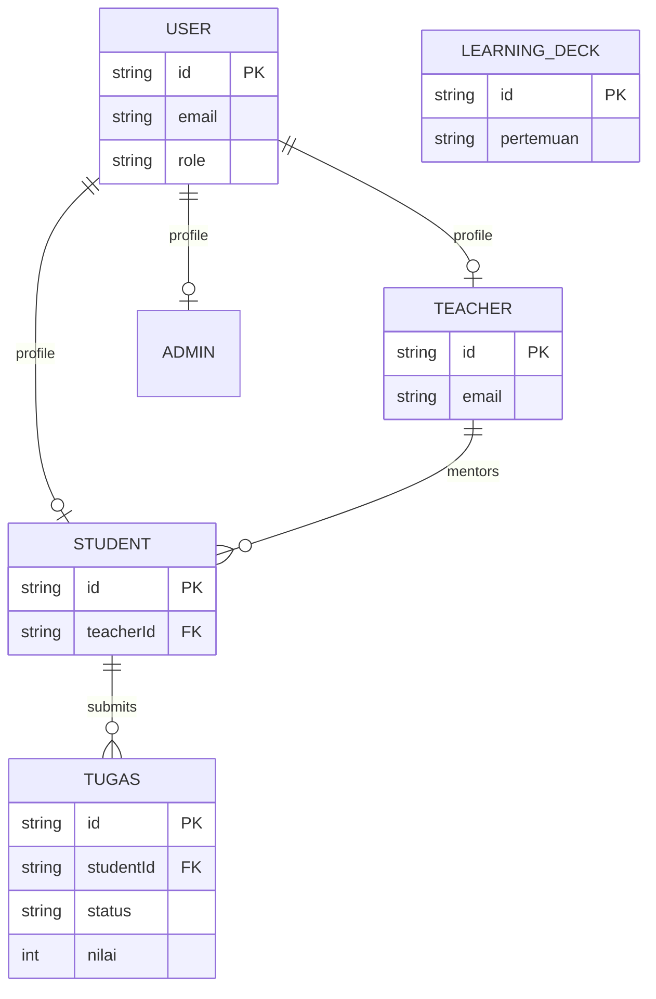

# Crack LMS Backend

REST API for a learning management system with Admin, Teacher, and Student roles.

## Features

- JWT registration and login with bcrypt password hashing
- Role-protected Admin, Teacher, Student, Learning Deck, and Assignment routes
- Prisma/PostgreSQL persistence with Teacher-Student and Student-Assignment relationships
- Assignment submission, resubmission, grading, score, feedback, and status tracking
- Searchable teacher, student, and learning-deck collections
- DTO validation, CORS, and unauthorized/forbidden responses

## Tech Stack

NestJS, TypeScript, Prisma, PostgreSQL, JWT, bcrypt, class-validator, and Jest.

## Setup

```bash
npm install
npx prisma generate
npx prisma migrate dev --name init
npm run start:dev
```

Set `DATABASE_URL`, `JWT_SECRET`, and optionally `FRONTEND_URL` in `.env`. The API listens on `PORT` or `3000`.

## Main API Routes

| Route | Access | Purpose |
| --- | --- | --- |
| `POST /auth/register` | Public | Create a role user |
| `POST /auth/login` | Public | Receive an access token |
| `/admins` | Admin | Manage administrators |
| `/teachers` | Authenticated | Manage/search teachers |
| `/students` | Authenticated | Manage/search students |
| `/learning-decks` | Authenticated | Browse and manage lessons |
| `/tugas` | Authenticated | Submit, resubmit, grade, and track assignments |

Send the token as `Authorization: Bearer <accessToken>`.

## ERD



## Deployment

Backend deployment URL: add the verified Render/Railway URL here after deployment.
[](https://classroom.github.com/a/EdN1T4tj)
